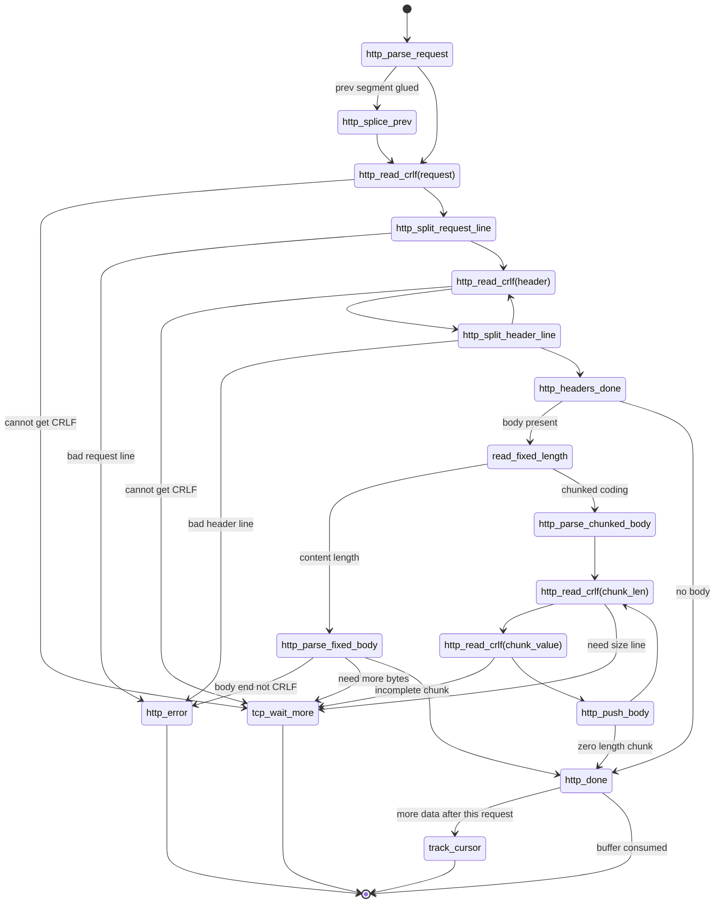

## http request 解析状态机
- 支持`tcp`中断和`tcp`黏包

##### 完整解析状态机流程图

```mermaid
stateDiagram-v2
    %% ─────────────────────  Top-level  ─────────────────────
    [*] --> http_parse_request

    http_parse_request --> http_splice_prev           : prev segment glued
    http_splice_prev  --> http_read_crlf(request)

    http_parse_request --> http_read_crlf(request)


    %% ──────────────────  Request-line section  ──────────────────
    http_read_crlf(request) --> tcp_wait_more         : cannot get CRLF
    http_read_crlf(request) --> http_split_request_line

    http_split_request_line --> http_error            : bad request line
    http_split_request_line --> http_read_crlf(header)

    %% ──────────────────  Header section  ──────────────────
    http_read_crlf(header) --> tcp_wait_more          : cannot get CRLF
    http_read_crlf(header) --> http_split_header_line

    http_split_header_line --> http_read_crlf(header)
    http_split_header_line --> http_error             : bad header line
    http_split_header_line --> http_headers_done

    %% ──────────────────  Body handling  ──────────────────
    http_headers_done --> read_fixed_length        : body present
    http_headers_done --> http_done                   : no body


    read_fixed_length --> http_parse_fixed_body    : content length
    read_fixed_length --> http_parse_chunked_body  : chunked coding


    http_parse_fixed_body --> http_error              : body end not CRLF
    http_parse_fixed_body --> tcp_wait_more           : need more bytes
    http_parse_fixed_body --> http_done


    http_parse_chunked_body --> http_read_crlf(chunk_len)

    http_read_crlf(chunk_len) --> http_read_crlf(chunk_value)
    http_read_crlf(chunk_len) --> tcp_wait_more       : need size line

    http_read_crlf(chunk_value) --> tcp_wait_more     : incomplete chunk
    http_read_crlf(chunk_value) --> http_push_body

    http_push_body --> http_read_crlf(chunk_len)
    http_push_body --> http_done                      : zero length chunk

    %% ──────────────────  Final bookkeeping  ──────────────────
    http_done --> track_cursor        : more data after this request
    http_done --> [*]                 : buffer consumed

    track_cursor --> [*]

    http_error   --> [*]
    tcp_wait_more --> [*]
```
